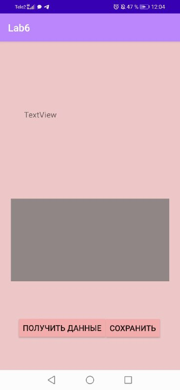
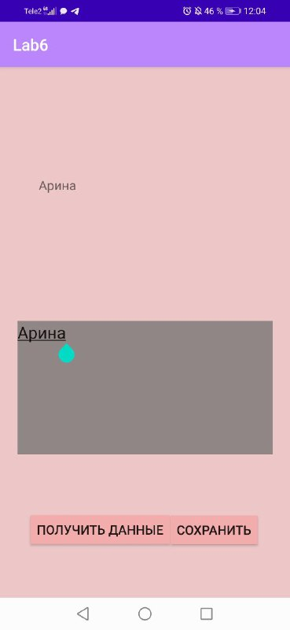
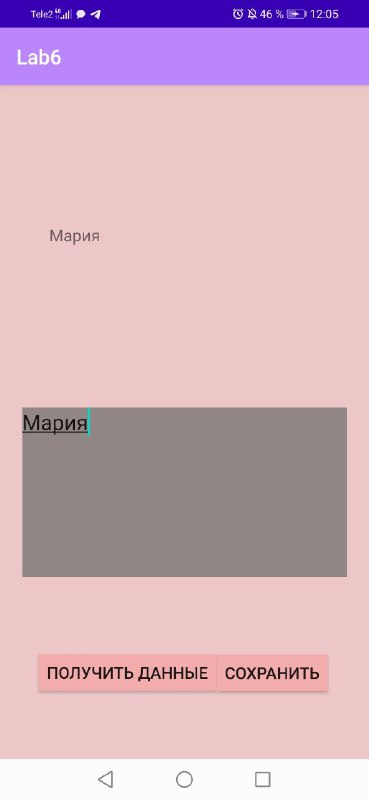

# Lab6
Лабораторная работа № 6

Тема: Настройки и состояние приложения.
Цель: Научиться сохранять данные при изменении ориентации
смартфона.
Задания:
1. Создали новый проект;
2. Добавили поле EditText тип textMultiLine;
3. Добавили 2 кнопки – Получили данные и сохранить данные и
создать для них обработчики событий;
4. Добавили поле TextView;
5. Добавили в них код:
6. Проверили работоспособность;
'''Java
package com.example.myapplication;

import android.support.v7.app.AppCompatActivity;
import android.os.Bundle;
import android.view.View;
import android.widget.TextView;

public class MainActivity extends AppCompatActivity {

    String name = "неопределено";
    final String nameVariableKey = "NAME_VAR";
    final String textViewTexKey = "TEXT_VIEW";

    @Override
    protected void onCreate(Bundle savedInstanceState) {
        super.onCreate(savedInstanceState);
        setContentView(R.layout.activity_main);
    }

    public void getField(View view) {

        TextView nameView = (TextView) findViewById(R.id.textView);
        nameView.setText(name);

    }

    public void saveField(View view) {
        TextView nameBox = (TextView)
                findViewById(R.id.editTextTextMultiLine);
        name = nameBox.getText().toString();
    }
}
'''

